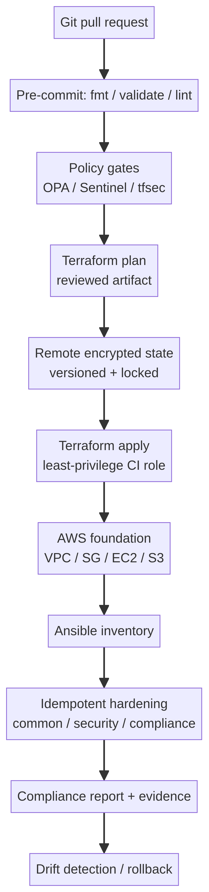

# Task 4 — Secure Infrastructure as Code Architecture

## Design objective

The proposed architecture makes infrastructure changes reviewable, reproducible, and reversible. Terraform owns cloud resources and their dependencies. Ansible configures operating systems after provisioning. Security controls run before and after deployment so that a successful `apply` is not confused with a secure environment. The design assumes that credentials, state, and generated plans are sensitive artifacts.

## Repository and module structure

A root Terraform configuration composes small modules for the network, security groups, compute, and storage layers. Each module exposes only the variables and outputs required by its caller. Environment-specific values live outside version control or in a protected workspace. A typical structure is `modules/network`, `modules/security`, `modules/compute`, and `modules/storage`, with `envs/dev` and `envs/prod` composing them. This separation reduces copy-and-paste drift and allows policy checks to target a predictable interface.

The Ansible side uses an inventory generated from Terraform outputs. The `common` role applies baseline packages, time zone, logging, and unattended upgrades. The `security` role hardens SSH, configures a default-deny firewall, enables fail2ban, and installs auditd rules. The `compliance` role performs read-only checks and writes evidence. Every task is designed to converge: running the playbook twice should produce no additional changes after the first successful run.

## State and secret management

Terraform state can contain resource identifiers, network details, and provider-derived secrets. Production state is stored in an encrypted remote backend with versioning and locking. Encryption keys are managed separately from the state bucket, and access is granted only to the CI role and a small operator group. State access is logged. Local state is acceptable only for isolated exercises and must be excluded from Git.

Secrets are not placed in `.tf` files, AMI images, or Ansible repositories. CI obtains short-lived credentials through an identity provider or a secret manager. Terraform variables are marked sensitive where appropriate, and Ansible uses Vault or an external secret lookup. Outputs avoid printing secret material. The example configuration intentionally uses placeholder values and documents the required secret boundaries.

## Policy enforcement and deployment flow

A pull request runs formatting, validation, static security scanning, and policy checks before a plan is generated. Policies reject public S3 access, unencrypted storage, unrestricted administrative ports, missing tags, and weak identity assumptions. The plan is saved as an immutable review artifact. A protected approval is required before apply, and the apply job uses a least-privilege role scoped to the target account and workspace.

Terraform establishes the base infrastructure. Its outputs feed a short-lived Ansible inventory. Ansible then applies operating-system hardening and produces a compliance report. The pipeline archives the plan, commit identifier, Terraform version, Ansible version, and compliance evidence. This gives reviewers a trace from source change to deployed configuration.

## Drift detection, rollback, and recovery

Drift detection runs on a low-frequency schedule and compares a fresh plan with the last approved state. A drift result creates a review item; it does not automatically overwrite an emergency manual change. The operator decides whether to import the legitimate change, revert it, or update the code. Cloud audit logs and state version history provide the evidence needed for that decision.

Rollback is versioned rather than improvised. A known-good Git commit is selected, a plan is generated, and the plan is reviewed before apply. For state corruption or accidental deletion, the operator restores a prior encrypted state version and re-runs validation. Compute replacement is preferred over in-place repair when an instance is suspected to be compromised. Ansible can reapply baseline configuration, but it is not a substitute for incident response or forensic preservation.

## Compliance validation

Compliance is expressed as executable checks. The pipeline confirms that the bucket is private, encrypted, and versioned; security groups expose only the documented ports; SSH disallows root login and password authentication; audit logging is enabled; and packages are current. Failed checks are reported with a clear remediation message. A passing report is evidence of the checks that ran, not a claim that the whole environment is risk-free.

The control boundary is documented so that teams do not confuse infrastructure checks with complete security assurance. Terraform validates cloud configuration and relationships, while Ansible validates host-level settings after the operating system is reachable. Application security, identity governance, vulnerability management, and incident response remain complementary controls. Each pipeline run records the commit, tool versions, policy bundle version, account or workspace, and target environment. These details make an exception reproducible and allow an auditor to reconstruct which rules were active at deployment time.

The architecture favors safe failure. A failed policy check stops before apply. A failed Ansible task stops the affected play rather than continuing with a partially hardened host. Notifications include the failed resource, the control that failed, and the remediation path. Break-glass access is time-limited, separately logged, and followed by a drift review. For development, the same modules can be tested with inexpensive or local targets, but production promotion still requires a protected approval and a fresh plan. This preserves developer feedback without weakening the production change boundary.

Ownership is reviewed quarterly. The service owner confirms that required ports, tags, retention periods, and approved images still match the business need. The security owner reviews policy exceptions and evidence retention. This review prevents a temporary deployment decision from becoming an unnoticed permanent exposure.

## References

[1]: https://developer.hashicorp.com/terraform/cloud-docs/recommended-practices/security "HashiCorp Terraform Cloud Security Best Practices"
[2]: https://developer.hashicorp.com/terraform/language/state/remote "Terraform Remote State Documentation"

