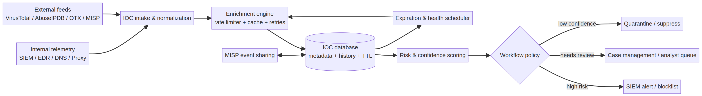

# Task 1 — Threat Intelligence Platform Architecture

## Design objective

The platform is an evidence-preserving enrichment service for a security operations center (SOC). It turns raw indicators of compromise (IOCs)—such as IP addresses, domains, URLs, and file hashes—into normalized, scored, time-bounded records that analysts can use without treating a single vendor response as ground truth. The design separates ingestion, enrichment, persistence, and workflow decisions so that a provider outage does not erase prior evidence or silently create a block.

## Data sources and intake

Internal sources provide the operational context that external reputation services cannot. Endpoint detection and response telemetry contributes process and host observations. DNS, proxy, firewall, email, and identity logs contribute first-seen and last-seen timestamps. The SIEM supplies alerts and correlation identifiers. External sources include VirusTotal, AbuseIPDB, AlienVault OTX, and a MISP instance. MISP is especially useful as a collaborative platform because events, attributes, tags, sightings, and sharing controls can be retained alongside the indicator rather than flattened into a single score [1].

An intake adapter accepts either a single indicator or a batch. It canonicalizes case, removes surrounding whitespace, validates the indicator type, and stores the original representation for audit. Duplicates are merged by a stable key consisting of type and normalized value. Every observation receives a source, retrieval time, confidence, and an optional case or event identifier. This design prevents an analyst note or internal sighting from being overwritten by a later external lookup.

## Enrichment engine and rate control

The enrichment engine uses provider adapters with a common interface. Each adapter validates the response schema and returns a typed result containing reputation, confidence, tags, provider timestamp, and an error state. A token-bucket or leaky-bucket limiter is maintained per provider. Requests are paced conservatively for free tiers, while exponential backoff with jitter handles HTTP 429 and transient 5xx responses. A bounded retry count prevents a provider incident from causing an unbounded queue.

The cache is keyed by provider, indicator type, and normalized value. A successful response has a configurable time-to-live; a failed response is cached briefly to avoid retry storms. The engine returns cached data with an explicit stale flag when a provider is unavailable. This distinction matters because stale evidence may guide triage but should not automatically trigger a permanent block. Provider keys are loaded from environment variables or an ignored local configuration file. Logs record request metadata and latency, never secret values.

## IOC database and scoring

The IOC database stores the lifecycle fields `first_seen`, `last_seen`, `expiration`, `confidence`, `risk_score`, `sources`, `observations`, and `status`. The record is append-aware: new observations update the aggregate without deleting the prior explanation. Expiration is calculated from indicator type and confidence. A high-confidence malicious hash can have a longer retention period than a low-confidence IP reputation, while an IOC with no recent sightings is automatically eligible for review.

Risk is a bounded 0–100 score. Each provider contributes a normalized signal, but source diversity increases confidence rather than simply adding duplicate votes. Internal sightings and corroboration from independent providers receive more weight than a single feed. The system also applies a false-positive guard: common infrastructure, allowlisted assets, benign vendor tags, contradictory provider results, and insufficient source diversity suppress automatic blocking. A high risk score therefore means “prioritized for action,” not “unconditionally malicious.”

## Workflow integration

The policy layer maps the score and confidence to actions. High-risk, high-confidence indicators can be exported to a SIEM blocklist with an expiration date. Medium-risk indicators create an analyst case containing provider evidence, internal sightings, and recommended next steps. Low-confidence or contradictory indicators are quarantined for review. MISP events can be created or updated with distribution restrictions, tags, and analyst comments. The export path is intentionally deterministic and auditable so an analyst can reproduce why an IOC was included.

A scheduled worker runs expiration checks, refreshes records approaching their TTL, and emits health metrics for provider success rate, cache hit rate, queue age, and stale-result percentage. Alerting is triggered by provider failure or database drift, not by every low-confidence indicator. The worker is safe to rerun because imports are idempotent and updates use stable keys.

## Resilience and governance

The architecture treats external intelligence as advisory evidence. Provider outages preserve cached responses and mark them stale. Database writes use atomic replacement and backups. Access is split between read-only enrichment workers and workflow writers. Retention, sharing, and deletion policies are documented for regulated environments. Analysts can override an automated disposition, and overrides are recorded with an identity, reason, and expiry. This creates a controlled feedback loop in which false-positive decisions improve future policy without destroying the underlying evidence.

Operational ownership is explicit. The SOC owns disposition policy and the allowlist, while the platform team owns provider adapters, credentials, and service health. A data steward reviews retention and sharing rules for indicators that contain personal or customer information. Every blocklist export includes the score, confidence, source timestamps, and expiration time in an adjacent audit record. The SIEM receives the indicator only after the policy decision is recorded. If an analyst reverses a block, the reversal becomes a labeled feedback event rather than an undocumented exception. This makes later tuning measurable and supports post-incident review.

The platform also protects the quality of its own inputs. Normalization rejects malformed indicators before they reach providers, and private or reserved address ranges can be routed to an internal-only policy. Provider disagreement is retained as a first-class signal, not averaged away. A dashboard shows the proportion of records with one, two, or three independent sources, together with the age of the newest observation. These measures help supervisors distinguish a genuinely quiet environment from a pipeline that has stopped receiving data. The result is a practical balance between automation speed, evidence quality, and analyst control.

## References

[1]: https://www.misp-project.org/ "MISP Project"

